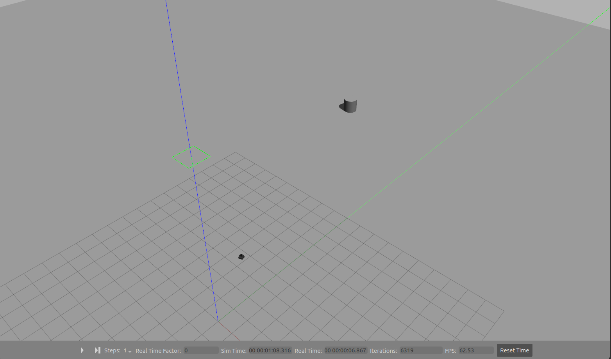

# Turtlebot

>This package is made for MLDA Robotics ROS Workshop 2.

This package uses a modified turtlebot3 gazebo simulation to control a turtlebot to hit a pillar.

The package turtlebot_demo contains a controller capable of detecting the nearest object based on subscribed LIDAR data and publishing velocity command to the robot.

## Preview


## Usage
To use the turtlebot_demo package, run the following commands:
```sh
export TURTLEBOT3_MODEL=waffle
roslaunch turtlebot_demo turtlebot_single_pillar.launch
```
