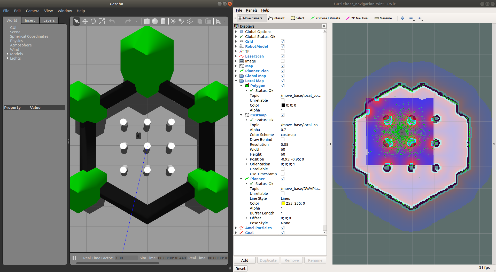

# Turtlebot

This package is made for **MLDA Robotics ROS Workshop 4 - Localization and Navigation using ROS**.  

This workshop uses a Gazebo simulation of the [TurtleBot3](https://www.turtlebot.com/) robot to see how we can make use of ROS [`gmapping`](https://wiki.ros.org/gmapping) to generate a map of the robot's surrounding, and ROS [2D navigation stack](https://wiki.ros.org/navigation) to allow the robot to automatically navigate in its environment.

# Usage
## Preparation
This package has been tested to run on **ROS Melodic and Noetic** on Ubuntu. You need to install several required ROS packages:
```bash
sudo apt install ros-$ROS_DISTRO-map-server ros-$ROS_DISTRO-teleop-twist-keyboard ros-$ROS_DISTRO-gmapping ros-$ROS_DISTRO-amcl ros-$ROS_DISTRO-move-base ros-$ROS_DISTRO-dwa-local-planner -y
```

Clone this repository inside your Catkin workspace:
```bash
cd ~/catkin_ws/src  # Change 'catkin_ws' if required
git clone -b nav-workshop https://github.com/Kenthoward20/Turtlebot.git
```

And build the workspace:
```bash
cd ~/catkin_ws  # Change 'catkin_ws' if required
catkin_make
```

## Basic Usage
Before running the examples, you need to source your Catkin workspace and specify which model of TurtleBot3 to be used (we will use `waffle` for this workshop). To automatically do those everytime a terminal is opened, you may run these in the terminal (once is enough):
```bash
echo 'source ~/catkin_ws/devel/setup.bash' >> ~/.bashrc  # Change 'catkin_ws' if required
echo 'export TURTLEBOT3_MODEL=waffle' >> ~/.bashrc
source ~/.bashrc
```

To launch the TurtleBot in the Gazebo environment:
```bash
roslaunch turtlebot3_bringup turtlebot3_gazebo_world.launch
```

You should then be greeted with the Gazebo simulation:  


To control the TurtleBot using keyboard (teleoperation), open a new terminal and run:
```bash
rosrun teleop_twist_keyboard teleop_twist_keyboard.py
```
You can now move the robot using your keyboard (follow the instruction printed on the terminal).

## Mapping the Environment with `gmapping`
To launch `gmapping` (Gazebo world must already be running), open a new terminal and run:
```bash
roslaunch turtlebot3_slam turtlebot3_gmapping.launch
```

You should now see an `rviz` window alongside Gazebo.  


As you can see, the generated map is not yet complete. Move the robot around the environment manually using keyboard control to cover the entire map. The finised map should look like the one you see in the Gazebo simulation:  

  
Now you can save the generated map. In a new terminal:
```bash
roscd turtlebot3_controller/maps  # We will save the map here
rosrun map_server map_saver -f map
# 'map' is the name of the map, you can change it to anything you like
```

Then, close everything.

## Navigation using ROS Navigation Stack
The TurtleBot should now be able to navigate autonomously in the Gazebo environment. Launch TurtleBot controller:
```bash
roslaunch turtlebot3_controller turtlebot3_controller.launch
```

>**Note:**  
If you named the map anything other than 'map', you must go inside the `turtlebot3_controller.launch` file and change line 5 (the argument `map_file`) to match your map name.

You should then see:  


To ask the robot to navigate autonomously to a goal position, click the "2D Nav Goal" button on the `rviz` window, then click anywhere on the map. Click and hold to change the desired final orientation of the robot.  
  
**Demo:**
